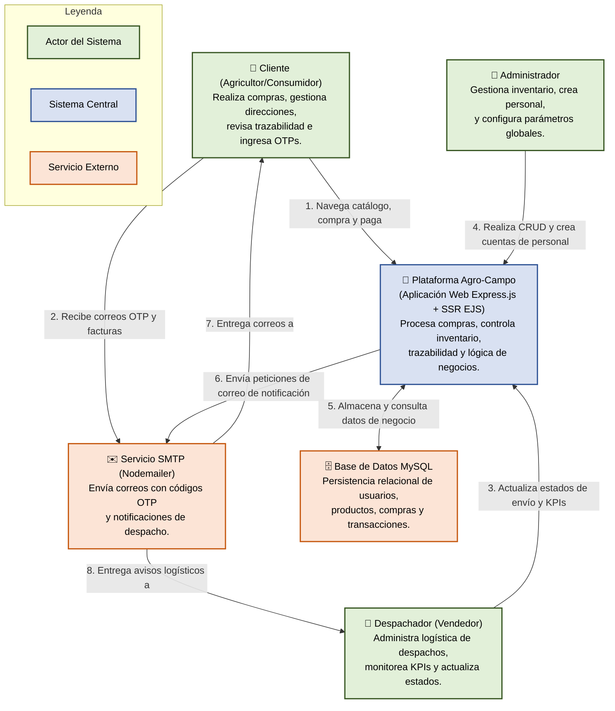
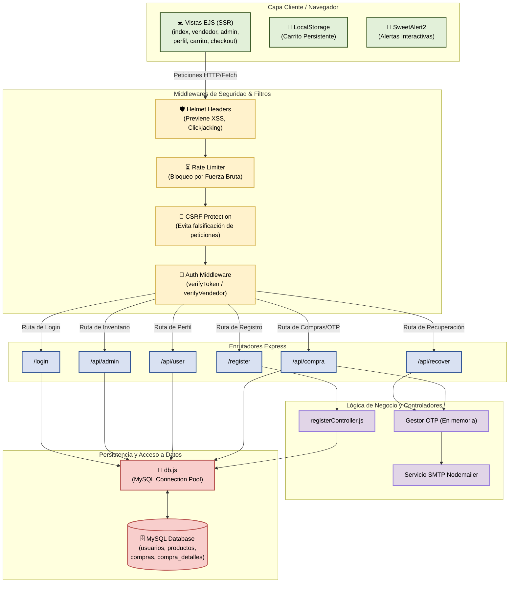
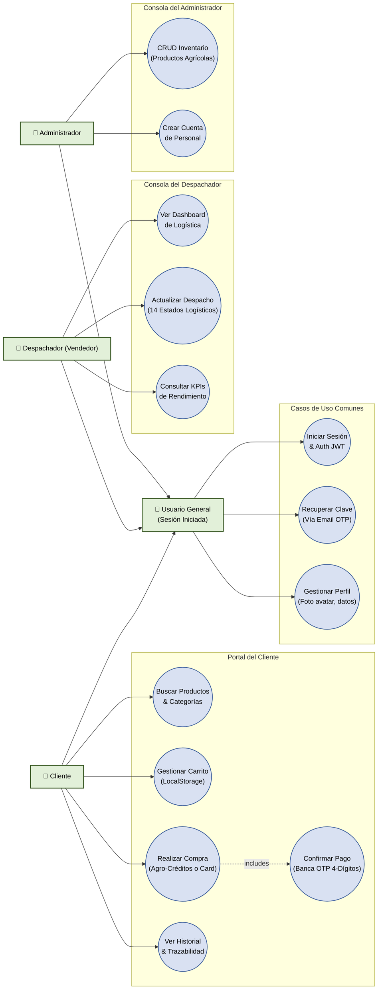
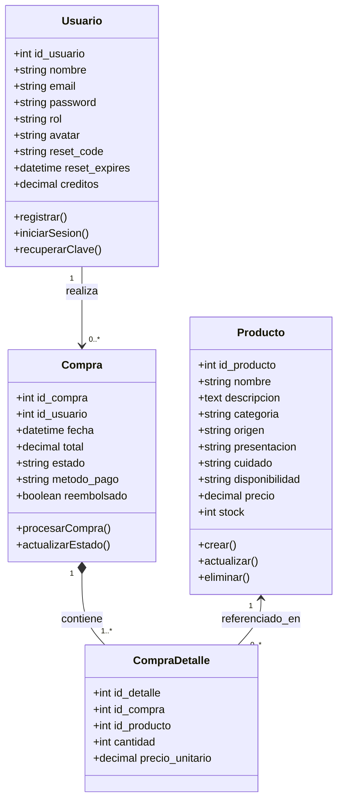
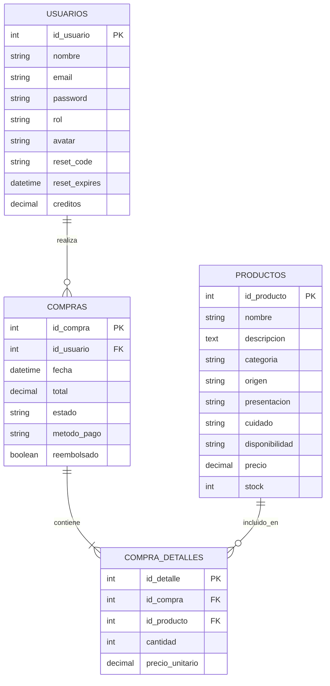

# 🌾 Agro-Campo: Documentación y Diagramas del Sistema

Este documento contiene la especificación visual y técnica de la arquitectura de la plataforma **Agro-Campo Logística y E-Commerce**. Los diagramas han sido diseñados utilizando **Mermaid**, permitiendo una renderización directa en GitHub, VS Code u otros entornos compatibles con Markdown.

---

## 📌 Tabla de Contenidos
1. [Diagrama de Contexto](#1-diagrama-de-contexto-nivel-1-c4)
2. [Diagrama de Componentes](#2-diagrama-de-componentes-nivel-3-c4)
3. [Diagrama de Casos de Uso](#3-diagrama-de-casos-de-uso)
4. [Diagrama de Arquitectura en Capas (N-Tier)](#4-diagrama-de-arquitectura-en-capas-n-tier)
5. [Diagrama de Flujo de Negocio (Compra, OTP y Despacho)](#5-diagrama-de-flujo-de-negocio-compra-otp-y-despacho)
6. [Diagrama de Clases UML (Modelo de Datos)](#6-diagrama-de-clases-uml-modelo-de-datos)
7. [Diagrama Entidad-Relación (Base de Datos / ERD)](#7-diagrama-entidad-relación-base-de-datos--erd)


---

## 1. Diagrama de Contexto (Nivel 1 C4)

El **Diagrama de Contexto** muestra los límites del sistema **Agro-Campo**, detallando los actores externos y los servicios de terceros con los que interactúa la plataforma a alto nivel.



### 📝 Resumen del Contexto:
* **Entrada**: Los usuarios ingresan a través del navegador web usando el frontend interactivo generado por Server-Side Rendering (EJS).
* **Procesamiento**: La aplicación web Node.js/Express valida la seguridad (JWT, CSRF, Rate Limiting) y ejecuta la lógica de compra y logística.
* **Almacenamiento**: Toda la información crítica transaccional y perfiles se guardan en la base de datos relacional MySQL.
* **Integración**: Nodemailer sirve como pasarela de mensajería saliente de forma asíncrona para control de seguridad (OTP) y alertas logísticas.

---

## 2. Diagrama de Componentes (Nivel 3 C4)

Este diagrama detalla cómo está estructurado el backend de **Agro-Campo**, mostrando las rutas, middlewares de seguridad, controladores de negocio y su relación con la base de datos.



---

## 3. Diagrama de Casos de Uso

El **Diagrama de Casos de Uso** ilustra los requerimientos del sistema agrupados por rol de usuario (Cliente, Despachador y Administrador), mostrando la herencia básica de sesión y las relaciones.



---

## 4. Diagrama de Arquitectura en Capas (N-Tier)

La plataforma utiliza una arquitectura **N-Tier (Multicapa)** para garantizar la separación de conceptos, la seguridad de la lógica y la fácil escalabilidad del proyecto.

```mermaid
graph TD
    classDef cap1 fill:#E2F0D9,stroke:#385723,stroke-width:2px;
    classDef cap2 fill:#FFF2CC,stroke:#D6B656,stroke-width:2px;
    classDef cap3 fill:#D9E1F2,stroke:#305496,stroke-width:2px;
    classDef cap4 fill:#E1D5E7,stroke:#967ADC,stroke-width:2px;
    classDef cap5 fill:#F8CECC,stroke:#B85450,stroke-width:2px;
    classDef cap6 fill:#D5E8D4,stroke:#82B366,stroke-width:2px;

    subgraph Capa_1 [1. Capa de Presentación (Frontend / Cliente)]
        EJS_V["Vistas SSR (EJS Template Engine)"]:::cap1
        Client_JS["Interacciones AJAX / Fetch API (Vanilla JS)"]:::cap1
        Styling["CSS3 Flexible & SweetAlert2 (Mensajería Visual)"]:::cap1
    end

    subgraph Capa_2 [2. Capa de Filtros y Seguridad (Middlewares)]
        Headers["Helmet HTTP Headers & CORS Control"]:::cap2
        RateLimit["Rate Limiters (Login limit & Global limit)"]:::cap2
        CSRF_P["CSRF Token Middleware Protection"]:::cap2
        Auth_P["JWT Cookie Auth Validation (HttpOnly Cookies)"]:::cap2
    end

    subgraph Capa_3 [3. Capa de Enrutamiento (Rutas API)]
        R_Express["Express Routers (/api/compra, /api/user, /login, etc.)"]:::cap3
        Body_Limiter["Limitadores de Carga del Body (Body-parser 1MB max)"]:::cap3
    end

    subgraph Capa_4 [4. Capa de Lógica de Negocio (Servicios)]
        Transact["Gestor de Transacciones SQL (Garantía de stock y créditos)"]:::cap4
        OTP_Service["Servicio de Generación de Claves de un Solo Uso (OTP)"]:::cap4
        Mail_Service["Módulo de Envío de Correos Automatizados (Nodemailer)"]:::cap4
    end

    subgraph Capa_5 [5. Capa de Acceso a Datos (Persistencia / DAL)]
        Pool["MySQL2 Connection Pool Manager"]:::cap5
        SQL_Ops["Operaciones SQL Atómicas (GREATEST stock checks)"]:::cap5
    end

    subgraph Capa_6 [6. Capa de Almacenamiento (Base de Datos / Data)]
        MySQL_Engine["MySQL Database Server (Relacional)"]:::cap6
    end

    %% Relaciones entre capas (flujo descendente estricto)
    Capa_1 --> Capa_2
    Capa_2 --> Capa_3
    Capa_3 --> Capa_4
    Capa_4 --> Capa_5
    Capa_5 --> Capa_6
```

---

## 5. Diagrama de Flujo de Negocio (Compra, OTP y Despacho)

Este diagrama de flujo describe el ciclo de vida completo de una compra dentro de **Agro-Campo**, desde que el cliente inicia la transacción, pasando por la validación de seguridad bancaria por **OTP**, la persistencia atómica en la base de datos, hasta el despacho y la trazabilidad del paquete a cargo del **Despachador**.

```mermaid
flowchart TD
    classDef startEnd fill:#F8CECC,stroke:#B85450,stroke-width:2px,color:#000000;
    classDef step fill:#D9E1F2,stroke:#305496,stroke-width:2px,color:#000000;
    classDef condition fill:#FFF2CC,stroke:#D6B656,stroke-width:2px,color:#000000;
    classDef notify fill:#E1D5E7,stroke:#967ADC,stroke-width:2px,color:#000000;

    %% Definición del flujo
    Inicio([🟢 Cliente inicia Checkout en /envio]):::startEnd
    IngresaDatos[Ingresa dirección de despacho y método de pago]:::step
    MetodoPago{¿Método de Pago<br>es Agro-Créditos?}:::condition
    
    %% Flujo OTP
    SolicitaOTP[Envía petición POST /api/compra/enviar-otp]:::step
    EnviaMailOTP[Sistema genera OTP de 4 dígitos y envía correo al Cliente]:::notify
    EsperaCodigo[Cliente recibe e ingresa el código OTP en la interfaz]:::step
    ValidaOTP{¿Código OTP<br>es válido y no expiró?}:::condition
    ErrorOTP[Muestra error en pantalla y cancela flujo]:::step
    FinError([🔴 Compra Cancelada]):::startEnd

    %% Registro de Compra Transaccional
    CrearCompra[POST /api/compra con lista de productos y totales]:::step
    ValidarIDOR{¿ID del JWT coincide<br>con idUser del body?}:::condition
    ErrorIDOR[Bloquea petición: 403 Forbidden]:::step
    
    IniciarTransaccion[Inicia Transacción en MySQL]:::step
    SuficientesCreditos{¿Tiene créditos<br>suficientes?}:::condition
    DescontarCreditos[Descuenta créditos de la cuenta del Cliente]:::step
    RollbackTrans[Ejecuta ROLLBACK y cancela transacción]:::step
    ErrorSaldo[Muestra mensaje de error: Saldo Insuficiente]:::step

    InsCabecera[Inserta cabecera en tabla 'compras' con estado: 'Pedido en preparación']:::step
    InsDetalles[Inserta líneas en 'compra_detalles' y reduce stock de productos en MySQL]:::step
    CommitTrans[Ejecuta COMMIT de la transacción]:::step
    EnviaFactura[Genera Factura Electrónica y envía correo automático via SMTP]:::notify

    %% Flujo del Despachador
    DashVendedor[Pedido aparece en el Dashboard del Despachador /vendedor]:::step
    AsignarEstado[Despachador actualiza el estado de tracking en ruta]:::step
    ActualizarDB[Ejecuta UPDATE compras SET estado = nuevoEstado]:::step
    NotificarCliente[Sistema envía email con plantilla de diseño adaptada al nuevo estado]:::notify
    
    Entregado{¿El nuevo estado<br>es 'Entrega exitosa'?<br>o 'Cancelado'}:::condition
    FinFlujo([🟢 Compra y Despacho Completado]):::startEnd
    Reembolsar{¿Estado es<br>'Reembolso procesado'?}:::condition
    ProcesarDevolucion[Retorna créditos a la cuenta del usuario en MySQL]:::step

    %% Conexiones
    Inicio --> IngresaDatos
    IngresaDatos --> MetodoPago
    
    MetodoPago -- Sí --> SolicitaOTP
    SolicitaOTP --> EnviaMailOTP
    EnviaMailOTP --> EsperaCodigo
    EsperaCodigo --> ValidaOTP
    
    ValidaOTP -- No --> ErrorOTP
    ErrorOTP --> FinError
    
    ValidaOTP -- Sí --> CrearCompra
    MetodoPago -- No (Tarjeta) --> CrearCompra
    
    CrearCompra --> ValidarIDOR
    ValidarIDOR -- No --> ErrorIDOR
    ErrorIDOR --> FinError
    
    ValidarIDOR -- Sí --> IniciarTransaccion
    IniciarTransaccion --> SuficientesCreditos
    
    SuficientesCreditos -- No --> RollbackTrans
    RollbackTrans --> ErrorSaldo
    ErrorSaldo --> FinError
    
    SuficientesCreditos -- Sí --> DescontarCreditos
    DescontarCreditos --> InsCabecera
    
    InsCabecera --> InsDetalles
    InsDetalles --> CommitTrans
    CommitTrans --> EnviaFactura
    
    EnviaFactura --> DashVendedor
    DashVendedor --> AsignarEstado
    AsignarEstado --> ActualizarDB
    ActualizarDB --> NotificarCliente
    NotificarCliente --> Entregado
    
    Entregado -- No --> Reembolsar
    Reembolsar -- Sí --> ProcesarDevolucion
    ProcesarDevolucion --> AsignarEstado
    Reembolsar -- No --> AsignarEstado
    
    Entregado -- Sí --> FinFlujo
```



---

### 🛡️ Medidas de Seguridad Incorporadas en el Flujo:
1. **Protección IDOR (A01)**: El middleware del backend valida estrictamente que el identificador del usuario que realiza la compra coincida con el token de sesión (`req.user.id`).
2. **Integridad Transaccional**: La inserción de la cabecera y el detalle de la compra, así como el descuento de créditos y la reducción de stock, se realizan dentro de una **transacción atómica** (COMMIT/ROLLBACK) para evitar inconsistencias de datos en la base de datos si ocurre un error a mitad de camino.
3. **Mecanismo de Descuento Seguro**: La reducción de stock se calcula de forma segura en la base de datos relacional para evitar errores de condición de carrera.

---

## 6. Diagrama de Clases UML (Modelo de Datos)

Este **Diagrama de Clases UML** representa el modelo de datos relacional y las entidades del dominio de **Agro-Campo**, detallando sus atributos primarios, tipos de datos, métodos conceptuales y las relaciones de cardinalidad que estructuran el sistema.



### 📝 Resumen del Modelo de Datos:
* **Usuario (clientes/vendedores/admins)**: Posee campos de seguridad (`password`, `reset_code`), datos de perfil (`avatar`), y saldo en `creditos` para compras con Agro-Créditos.
* **Producto**: Contiene la información técnica agrícola y el `stock` que se descuenta atómicamente en cada compra.
* **Compra**: Entidad transaccional vinculada a un cliente. Rastrea el estado del despacho (hasta 14 estados logísticos) y el método de pago empleado.
* **CompraDetalle**: Tabla intermedia que resuelve la relación de muchos a muchos entre `Compra` y `Producto`, guardando la `cantidad` y el `precio_unitario` al momento exacto de la venta para mantener un registro histórico inmutable.

---

## 7. Diagrama Entidad-Relación (Base de Datos / ERD)

Este **Diagrama Entidad-Relación (ERD)** ilustra de forma clara y normalizada la estructura de la base de datos relacional de **Agro-Campo**, especificando llaves primarias (PK), llaves foráneas (FK), los tipos de datos exactos de cada columna y las restricciones e integridad referencial del motor InnoDB.



### 🔑 Detalle de Cardinalidad e Integridad de la Base de Datos:
1. **USUARIOS a COMPRAS (`1:N` / `Zero-to-Many`)**: Un usuario registrado puede no tener compras registradas en el sistema (por ejemplo, una cuenta nueva), o bien haber realizado múltiples compras a lo largo del tiempo.
2. **COMPRAS a COMPRA_DETALLES (`1:N` / `One-to-Many`)**: Cada registro de compra en la cabecera debe obligatoriamente contener uno o más detalles de productos específicos adquiridos. Si la compra se elimina, se ejecuta una acción `ON DELETE CASCADE` sobre los detalles relacionados.
3. **PRODUCTOS a COMPRA_DETALLES (`1:N` / `Zero-to-Many`)**: Un producto puede estar listado en el catálogo sin haber sido comprado aún por nadie (`0`), o bien haber sido referenciado en múltiples detalles de compra.


