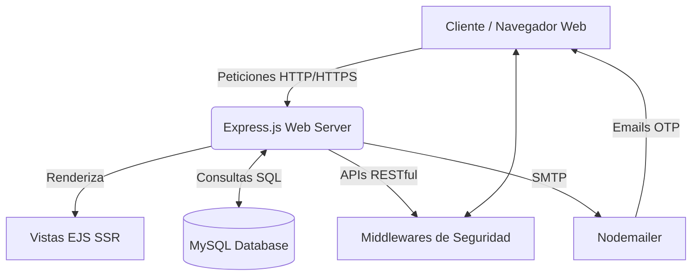
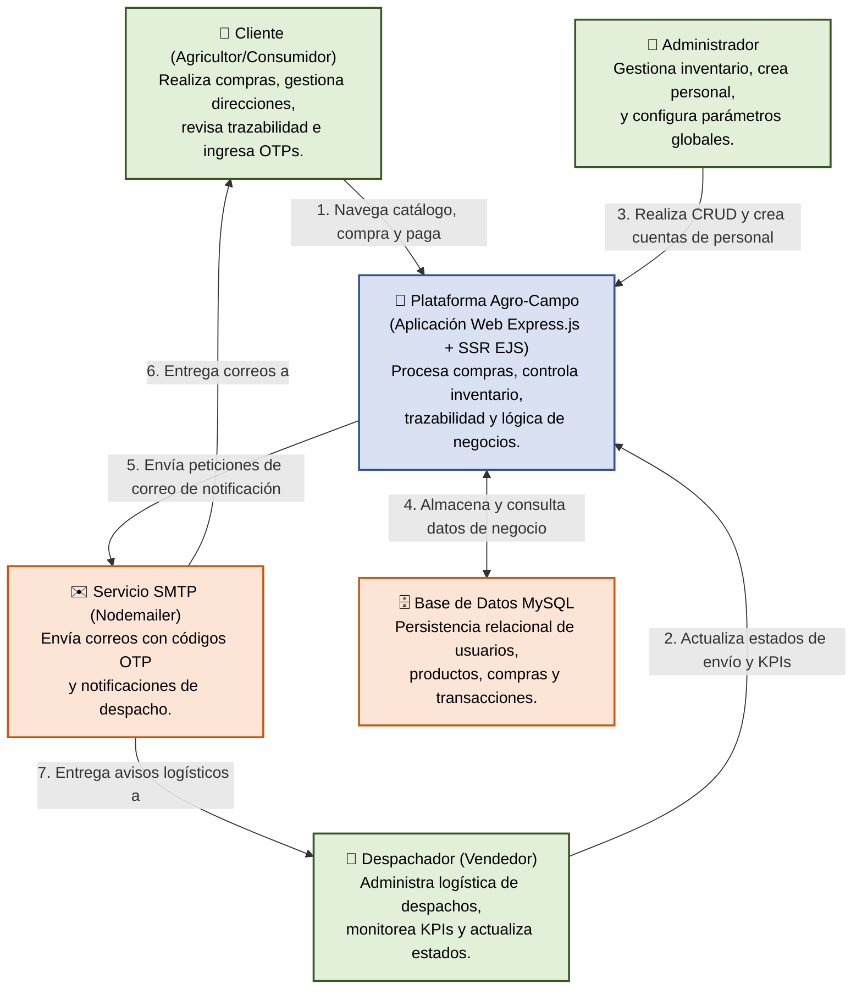
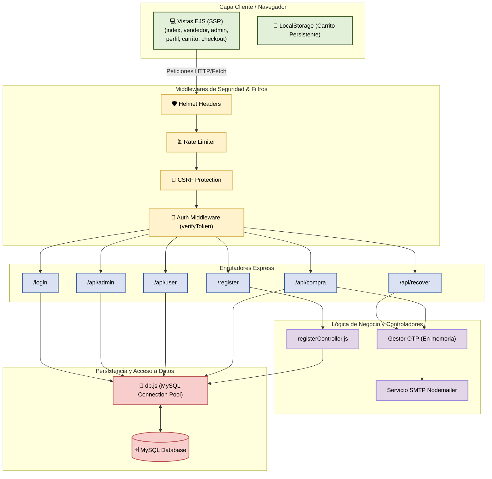
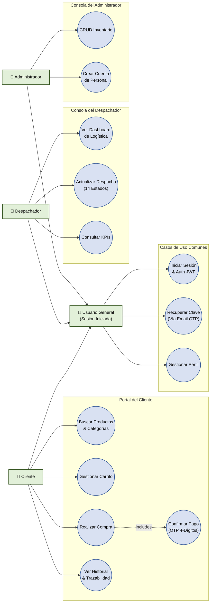
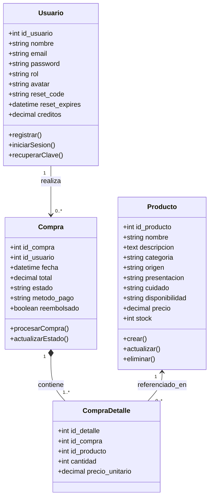
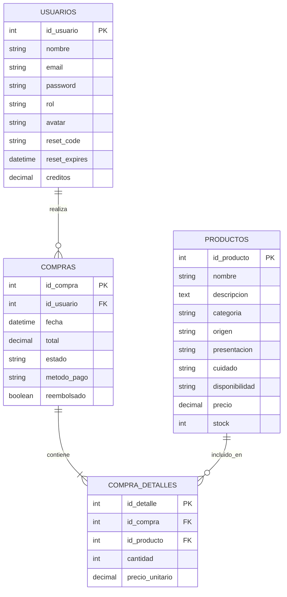

# 🌾 Agro-Campo Logística y Comercio Electrónico


**Agro-Campo** es una plataforma web integral orientada al sector agrícola, desarrollada como un Trabajo de Culminación de Curso (TCC). Su propósito fundamental es eliminar los intermediarios innecesarios conectando directamente a los productores y comerciantes del campo con los consumidores finales.

Para lograr esto, la plataforma combina un **sistema robusto de E-commerce** para los clientes y una **consola avanzada de logística y despacho** para los administradores y vendedores, garantizando seguridad, trazabilidad de envíos y una experiencia de usuario altamente interactiva.

---

## 📖 Tabla de Contenidos
1. [Arquitectura del Sistema](#%EF%B8%8F-arquitectura-del-sistema)
2. [Módulos Principales](#-módulos-principales)
3. [Estructura de Seguridad](#-estructura-de-seguridad)
4. [Stack Tecnológico](#%EF%B8%8F-stack-tecnológico)
5. [Diagrama de Base de Datos](#%EF%B8%8F-diagrama-de-base-de-datos)
6. [Diagramas del Sistema](#-diagramas-del-sistema)
7. [Instalación y Despliegue](#%EF%B8%8F-instalación-y-despliegue)
8. [Documentación de la API Rest](#-documentación-de-la-api-rest)
9. [Mejoras Futuras](#-mejoras-futuras)

---

## 🏗️ Arquitectura del Sistema

El proyecto está construido bajo una arquitectura **Cliente-Servidor Híbrida**. Utiliza **Server-Side Rendering (SSR)** mediante el motor de plantillas `EJS` para servir las páginas de manera rápida y segura (optimizando el SEO y ocultando lógica de negocio), al tiempo que utiliza **AJAX / Fetch API** en el cliente para mantener una interactividad fluida sin recargar la página.



---

## 🚀 Módulos Principales

### 1. 🧑‍🌾 Portal del Cliente (E-Commerce)
* **Catálogo Dinámico:** Separación por categorías especializadas (Semillas, Lácteos, Abonos, Ferretería, Cosechas, Maquinaria).
* **Buscador en Tiempo Real:** Barra de búsqueda predictiva que consulta el inventario al instante.
* **Carrito de Compras Persistente:** Almacenamiento local mediante `localStorage` que evita la pérdida de productos seleccionados si el usuario cierra la pestaña.
* **Pasarela Multistep (Checkout):** Flujo de pago paso a paso, gestionando múltiples direcciones de envío del usuario y cálculo automático de totales.

### 2. 🚚 Consola del Despachador (Logística)
* **Dashboard en Tiempo Real:** Un panel de control exclusivo para el rol "Despachador" que permite visualizar los pedidos entrantes.
* **Sistema de Trazabilidad (Tracking):** Capacidad de cambiar el estado de los pedidos a través de 14 etapas (ej. *Pedido en preparación*, *Producto en tránsito*, *Entrega exitosa*).
* **Métricas de Eficiencia (KPIs):** Cálculo automático del rendimiento del despachador, mostrando envíos completados hoy y tasas de éxito.
* **Perfil Premium:** Entorno aislado para configurar foto de perfil (avatares de granja), datos de contacto y contraseña.

### 3. 👑 Portal Administrativo
* **Gestión del Inventario (CRUD):** Creación, lectura, actualización y eliminación de productos desde un panel protegido.
* **Campos Personalizados:** Administración de detalles específicos como "Origen", "Cuidados", "Disponibilidad" y "Presentación" para los productos agrícolas.

### 4. 🛡️ Perfiles de Usuario (Mi Agro-Perfil)
* Panel de administración de datos personales.
* Historial completo de compras con capacidad de ver el progreso del paquete paso a paso mediante un visualizador estilo "Línea de Tiempo".
* Gestión del monedero virtual de **Agro-Créditos**.

---

## 🔐 Estructura de Seguridad
Se han implementado rigurosas políticas de seguridad mitigando las vulnerabilidades del OWASP Top 10:

* **Autenticación Basada en Tokens (JWT):** Las sesiones se manejan mediante *JSON Web Tokens* almacenados en cookies protegidas bajo la directiva `HttpOnly`, previniendo ataques de tipo XSS (Cross-Site Scripting).
* **Protección CSRF:** Middleware `csurf` que genera y valida tokens en cada formulario, bloqueando solicitudes falsificadas entre sitios.
* **Mecanismos OTP (One Time Password):** Operaciones críticas como el cambio de contraseña, restablecimiento de accesos y confirmación de pagos con Agro-Créditos requieren un código numérico aleatorio de 4–6 dígitos enviado por correo electrónico mediante `Nodemailer`.
* **Rate Limiting & HPP:** Limitación estricta de peticiones desde la misma IP (Prevención de ataques de Fuerza Bruta y DDoS) utilizando `express-rate-limit` y prevención de contaminación de parámetros HTTP con `hpp`.
* **Encriptación Criptográfica:** Uso de `bcrypt` con 12 salt rounds para el almacenamiento encriptado de las contraseñas en la base de datos.
* **Helmet.js:** Cabeceras HTTP de seguridad configuradas automáticamente (CSP, X-Frame-Options, HSTS) para prevenir Clickjacking y otros ataques comunes.
* **Validación de Entradas:** `express-validator` sanitiza y valida todos los campos de entrada del usuario antes de procesarlos.
* **Protección IDOR (A01 OWASP):** El backend valida que el `id` del JWT coincida con el `idUser` del body en todas las operaciones sensibles, bloqueando con `403 Forbidden` cualquier intento de acceso a recursos ajenos.

---

## 🛠️ Stack Tecnológico

### Backend & Servidor
| Paquete | Versión | Función |
|---------|---------|---------|
| **Node.js** | v16+ | Entorno de ejecución JavaScript del lado del servidor. |
| **Express.js** | ^5.1.0 | Framework web para enrutamiento, middlewares y API REST. |
| **mysql2** | ^3.14.1 | Driver de conexión a MySQL con soporte a Promesas y Pool de conexiones. |
| **dotenv** | ^16.5.0 | Gestión de variables de entorno desde archivos `.env`. |
| **path** | ^0.12.7 | Utilidad nativa para manejo de rutas de archivos del sistema. |

### Motor de Vistas & Frontend
| Paquete / Tecnología | Versión | Función |
|----------------------|---------|---------|
| **EJS** (Embedded JavaScript) | ^5.0.2 | Motor de plantillas para generación de vistas SSR en el servidor. |
| **HTML5** | — | Estructura semántica de todas las páginas de la plataforma. |
| **CSS3** | — | Estilos, animaciones, diseño responsive y tematización de la UI. |
| **JavaScript Vanilla** | — | Lógica interactiva del cliente, AJAX, Fetch API y manejo del carrito. |
| **SweetAlert2** | CDN | Alertas y diálogos interactivos con diseño premium. |
| **html2pdf.js** | CDN | Generación y descarga de facturas en formato PDF desde el navegador. |

### Seguridad
| Paquete | Versión | Función |
|---------|---------|---------|
| **jsonwebtoken** | ^9.0.3 | Generación y verificación de tokens JWT para autenticación de sesión. |
| **bcrypt** | ^6.0.0 | Hasheo seguro de contraseñas con salt rounds configurable. |
| **helmet** | ^8.1.0 | Configuración automática de cabeceras HTTP de seguridad. |
| **csurf** | ^1.11.0 | Protección contra ataques Cross-Site Request Forgery (CSRF). |
| **express-rate-limit** | ^8.5.2 | Limitación de peticiones por IP para prevenir fuerza bruta y DDoS. |
| **hpp** | ^0.2.3 | Prevención de contaminación de parámetros HTTP (HTTP Parameter Pollution). |
| **express-validator** | ^7.3.2 | Validación y sanitización de datos de entrada del usuario. |
| **html-escaper** | ^3.0.3 | Escape de caracteres HTML para prevenir inyecciones XSS en las vistas. |
| **cookie-parser** | ^1.4.7 | Parseo y firma de cookies para gestión segura de sesiones. |

### Comunicación & Utilidades
| Paquete | Versión | Función |
|---------|---------|---------|
| **Nodemailer** | ^8.0.7 | Envío de correos electrónicos (OTP, facturas, notificaciones de despacho) via SMTP. |
| **cors** | ^2.8.6 | Control de acceso de origen cruzado (CORS) para las APIs. |
| **body-parser** | ^2.2.0 | Parseo del cuerpo de peticiones HTTP (JSON, URL-encoded) con límite de 1MB. |

---

## 🗄️ Diagrama de Base de Datos
El sistema utiliza una estructura relacional altamente normalizada bajo el motor **InnoDB** de MySQL:

* **`usuarios`**: Almacena credenciales, roles (Admin=1, Despachador=2, Cliente=0), créditos, tokens OTP y avatares en Base64.
* **`productos`**: Catálogo completo con precios decimales, categorías, stock, imágenes y detalles técnicos agrícolas (origen, presentación, cuidado, disponibilidad).
* **`compras`**: Registro de cabecera de la factura (total, fecha, estado logístico, método de pago, flag de reembolso).
* **`compra_detalles`**: Desglose de cada producto dentro de una compra específica con precio histórico al momento de la venta.

---

## 📊 Diagramas del Sistema

> Los diagramas a continuación están escritos en **Mermaid** y se renderizan automáticamente en GitHub, VS Code y entornos compatibles. Para verlos todos en detalle, consulta el archivo [`DIAGRAMAS.md`](./DIAGRAMAS.md).

---

### 1. 🌐 Diagrama de Contexto (C4 — Nivel 1)
Muestra los límites del sistema y los actores externos que interactúan con la plataforma.



---

### 2. 🔌 Diagrama de Componentes (C4 — Nivel 3)
Detalla la estructura interna del backend: middlewares de seguridad, enrutadores Express y controladores.



---

### 3. 👥 Diagrama de Casos de Uso
Ilustra los requerimientos funcionales del sistema asignados por rol de actor.



---

### 4. 🏢 Diagrama de Arquitectura en Capas (N-Tier)
Flujo descendente estricto de las llamadas entre las 6 capas de la arquitectura.

```mermaid
graph TD
    classDef cap1 fill:#E2F0D9,stroke:#385723,stroke-width:2px;
    classDef cap2 fill:#FFF2CC,stroke:#D6B656,stroke-width:2px;
    classDef cap3 fill:#D9E1F2,stroke:#305496,stroke-width:2px;
    classDef cap4 fill:#E1D5E7,stroke:#967ADC,stroke-width:2px;
    classDef cap5 fill:#F8CECC,stroke:#B85450,stroke-width:2px;
    classDef cap6 fill:#D5E8D4,stroke:#82B366,stroke-width:2px;

    subgraph Capa_1 [1. Capa de Presentación]
        EJS_V["Vistas SSR (EJS Template Engine)"]:::cap1
        Client_JS["Interacciones AJAX / Fetch API (Vanilla JS)"]:::cap1
        Styling["CSS3 & SweetAlert2"]:::cap1
    end

    subgraph Capa_2 [2. Capa de Filtros y Seguridad]
        Headers["Helmet HTTP Headers & CORS"]:::cap2
        RateLimit["Rate Limiters (express-rate-limit & hpp)"]:::cap2
        CSRF_P["CSRF Token Middleware (csurf)"]:::cap2
        Auth_P["JWT Cookie Auth (jsonwebtoken + cookie-parser)"]:::cap2
    end

    subgraph Capa_3 [3. Capa de Enrutamiento]
        R_Express["Express Routers (/api/compra, /api/user, /login…)"]:::cap3
        Body_Limiter["body-parser (límite 1MB)"]:::cap3
    end

    subgraph Capa_4 [4. Capa de Lógica de Negocio]
        Transact["Gestor de Transacciones SQL (stock y créditos)"]:::cap4
        OTP_Service["Servicio OTP (generación en memoria)"]:::cap4
        Mail_Service["Módulo Nodemailer (SMTP)"]:::cap4
    end

    subgraph Capa_5 [5. Capa de Acceso a Datos]
        Pool["mysql2 Connection Pool Manager"]:::cap5
        SQL_Ops["Operaciones SQL Atómicas (COMMIT / ROLLBACK)"]:::cap5
    end

    subgraph Capa_6 [6. Capa de Almacenamiento]
        MySQL_Engine["MySQL Database Server InnoDB"]:::cap6
    end

    Capa_1 --> Capa_2 --> Capa_3 --> Capa_4 --> Capa_5 --> Capa_6
```



---

### 5. 🔄 Diagrama de Flujo de Negocio (Compra, OTP y Despacho)
Ciclo de vida completo de un pedido, desde el checkout hasta la entrega final.

```mermaid
flowchart TD
    classDef startEnd fill:#F8CECC,stroke:#B85450,stroke-width:2px,color:#000000;
    classDef step fill:#D9E1F2,stroke:#305496,stroke-width:2px,color:#000000;
    classDef condition fill:#FFF2CC,stroke:#D6B656,stroke-width:2px,color:#000000;
    classDef notify fill:#E1D5E7,stroke:#967ADC,stroke-width:2px,color:#000000;

    Inicio([🟢 Cliente inicia Checkout en /envio]):::startEnd
    IngresaDatos[Ingresa dirección de despacho y método de pago]:::step
    MetodoPago{¿Método de Pago<br>es Agro-Créditos?}:::condition
    SolicitaOTP[Envía petición POST /api/compra/enviar-otp]:::step
    EnviaMailOTP[Sistema genera OTP de 4 dígitos y envía correo]:::notify
    EsperaCodigo[Cliente ingresa el código OTP en la interfaz]:::step
    ValidaOTP{¿Código OTP<br>válido y no expiró?}:::condition
    ErrorOTP[Muestra error en pantalla]:::step
    FinError([🔴 Compra Cancelada]):::startEnd
    CrearCompra[POST /api/compra con lista de productos]:::step
    ValidarIDOR{¿ID del JWT coincide<br>con idUser del body?}:::condition
    ErrorIDOR[Bloquea petición: 403 Forbidden]:::step
    IniciarTransaccion[Inicia Transacción en MySQL]:::step
    SuficientesCreditos{¿Tiene créditos<br>suficientes?}:::condition
    DescontarCreditos[Descuenta créditos del Cliente]:::step
    RollbackTrans[Ejecuta ROLLBACK]:::step
    ErrorSaldo[Error: Saldo Insuficiente]:::step
    InsCabecera[Inserta cabecera en tabla 'compras']:::step
    InsDetalles[Inserta 'compra_detalles' y reduce stock]:::step
    CommitTrans[Ejecuta COMMIT de la transacción]:::step
    EnviaFactura[Genera Factura y envía correo via SMTP]:::notify
    DashVendedor[Pedido aparece en Dashboard del Despachador]:::step
    AsignarEstado[Despachador actualiza estado de tracking]:::step
    ActualizarDB[UPDATE compras SET estado = nuevoEstado]:::step
    NotificarCliente[Sistema envía email con el nuevo estado]:::notify
    Entregado{¿Estado es<br>'Entrega exitosa'<br>o 'Cancelado'?}:::condition
    FinFlujo([🟢 Compra y Despacho Completado]):::startEnd
    Reembolsar{¿Estado es<br>'Reembolso procesado'?}:::condition
    ProcesarDevolucion[Retorna créditos al usuario en MySQL]:::step

    Inicio --> IngresaDatos --> MetodoPago
    MetodoPago -- Sí --> SolicitaOTP --> EnviaMailOTP --> EsperaCodigo --> ValidaOTP
    ValidaOTP -- No --> ErrorOTP --> FinError
    ValidaOTP -- Sí --> CrearCompra
    MetodoPago -- No (Tarjeta) --> CrearCompra
    CrearCompra --> ValidarIDOR
    ValidarIDOR -- No --> ErrorIDOR --> FinError
    ValidarIDOR -- Sí --> IniciarTransaccion --> SuficientesCreditos
    SuficientesCreditos -- No --> RollbackTrans --> ErrorSaldo --> FinError
    SuficientesCreditos -- Sí --> DescontarCreditos --> InsCabecera --> InsDetalles --> CommitTrans --> EnviaFactura
    EnviaFactura --> DashVendedor --> AsignarEstado --> ActualizarDB --> NotificarCliente --> Entregado
    Entregado -- No --> Reembolsar
    Reembolsar -- Sí --> ProcesarDevolucion --> AsignarEstado
    Reembolsar -- No --> AsignarEstado
    Entregado -- Sí --> FinFlujo
```



---

### 6. 📐 Diagrama de Clases UML (Modelo de Dominio)
Entidades del dominio con sus atributos, métodos de servicio y relaciones de cardinalidad.



---

### 7. 🗄️ Diagrama Entidad-Relación (ERD — Base de Datos)
Estructura de la base de datos relacional con llaves primarias (PK), foráneas (FK) y cardinalidades exactas.



---

## ⚙️ Instalación y Despliegue

### Requisitos Previos
* [Node.js](https://nodejs.org/) v16+
* [MySQL Server](https://dev.mysql.com/downloads/mysql/) v8+
* Servidor SMTP válido (ej. Cuenta de Gmail con contraseña de aplicación).

### Pasos

1. **Clonar el repositorio:**
   ```bash
   git clone https://github.com/tu-usuario/TCC-Agro-Campo.git
   cd TCC-Agro-Campo
   ```

2. **Instalar dependencias del proyecto:**
   ```bash
   npm install
   ```

3. **Configurar el Entorno (`.env`):**
   Crea un archivo `.env` en la raíz del proyecto con tus claves:
   ```env
   # Servidor
   PORT=3000

   # Base de datos MySQL
   DB_HOST=localhost
   DB_USER=root
   DB_PASSWORD=tu_contraseña_mysql
   DB_NAME=registro_usuarios

   # Seguridad y Sesiones
   JWT_SECRET=escribe_aqui_una_cadena_larga_y_segura

   # Configuración de Correo (Nodemailer OTP)
   EMAIL_USER=tucorreo@gmail.com
   EMAIL_PASS=tu_contraseña_de_aplicacion_google
   ```

4. **Preparar la Base de Datos:**
   El modelo relacional se crea automáticamente al iniciar la aplicación. Solo asegúrate de tener una base de datos llamada `registro_usuarios` (o la que definas en `DB_NAME`) en tu servidor MySQL.

5. **Iniciar la aplicación:**
   ```bash
   node app.js
   ```
   La aplicación estará corriendo en `http://localhost:3000`.

---

## 🔌 Documentación de la API Rest (Endpoints Principales)

| Método | Endpoint | Roles Permitidos | Descripción |
|--------|----------|------------------|-------------|
| **POST** | `/login` | Todos | Autentica al usuario y retorna Cookie JWT. |
| **POST** | `/register` | Público | Registra un nuevo usuario en el sistema. |
| **POST** | `/api/recover/request` | Todos | Genera código OTP de seguridad para restablecimiento. |
| **POST** | `/api/recover/verify` | Todos | Valida el código OTP e impone nueva contraseña. |
| **POST** | `/api/compra/enviar-otp` | Cliente | Genera y envía el OTP bancario de 4 dígitos por correo. |
| **POST** | `/api/compra` | Cliente | Registra una nueva compra en la BD (transacción atómica). |
| **GET** | `/api/compra/todas` | Admin, Despachador | Devuelve el listado completo de pedidos activos. |
| **PUT** | `/api/compra/:id/estado` | Admin, Despachador | Actualiza la fase de envío y notifica por email. |
| **GET** | `/api/admin/productos` | Administrador | Lista el inventario completo del catálogo. |
| **POST** | `/api/admin/productos` | Administrador | Crea un nuevo producto en el inventario. |
| **PUT** | `/api/admin/productos/:id` | Administrador | Actualiza los datos de un producto existente. |
| **DELETE** | `/api/admin/productos/:id` | Administrador | Elimina un producto del catálogo. |
| **GET** | `/api/user/:id` | Todos (su propio ID) | Obtiene los datos del perfil y créditos del usuario. |
| **PUT** | `/api/user/:id` | Todos (su propio ID) | Modifica la configuración de cuenta o contraseña. |

---

## 📈 Mejoras Futuras y Escalabilidad
Al haber utilizado tecnologías estándar y una arquitectura de enrutamiento limpia en Express.js, el proyecto está preparado para escalar:

1. **Integración de Pasarela de Pago Real:** Añadir integración con APIs como Stripe o MercadoPago para cobrar con tarjetas de crédito.
2. **Sistema de Chat en Tiempo Real:** Implementar WebSockets (Socket.io) para comunicación directa entre clientes y despachadores.
3. **PWA Offline:** Expandir el Service Worker para permitir el escaneo de códigos de barras por parte del despachador sin conexión a internet.
4. **Migración a ORM:** Adoptar Prisma o Sequelize para un manejo más robusto y tipado del modelo de datos.
5. **Sistema de Notificaciones Push:** Integrar Web Push API para alertar a los clientes sobre cambios de estado de sus pedidos en tiempo real.

---

📝 *Proyecto de Grado desarrollado en 2026. Documentación generada para propósitos académicos y de evaluación de software.*
