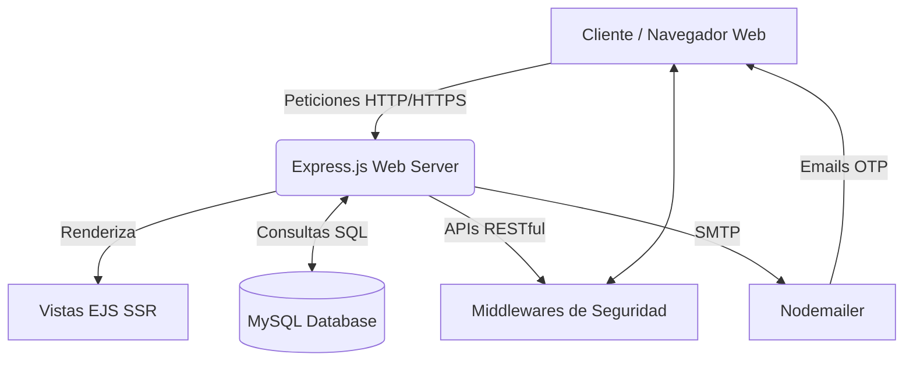

# 🌾 Agro-Campo Logística y E-Commerce


**Agro-Campo** es una plataforma web integral orientada al sector agrícola, desarrollada como un Trabajo de Culminación de Curso (TCC). Su propósito fundamental es eliminar los intermediarios innecesarios conectando directamente a los productores y comerciantes del campo con los consumidores finales. 

Para lograr esto, la plataforma combina un **sistema robusto de E-commerce** para los clientes y una **consola avanzada de logística y despacho** para los administradores y vendedores, garantizando seguridad, trazabilidad de envíos y una experiencia de usuario altamente interactiva.

---

## 📖 Tabla de Contenidos
1. [Arquitectura del Sistema](#-arquitectura-del-sistema)
2. [Módulos Principales](#-módulos-principales)
3. [Estructura de Seguridad](#-estructura-de-seguridad)
4. [Stack Tecnológico](#-stack-tecnológico)
5. [Diagrama de Base de Datos](#-diagrama-de-base-de-datos)
6. [Instalación y Despliegue](#-instalación-y-despliegue)
7. [Documentación de la API Rest](#-documentación-de-la-api-rest)
8. [Mejoras Futuras](#-mejoras-futuras)

---

## 🏗️ Arquitectura del Sistema

El proyecto está construido bajo una arquitectura **Cliente-Servidor Híbrida**. Utiliza **Server-Side Rendering (SSR)** mediante el motor de plantillas `EJS` para servir las páginas de manera rápida y segura (optimizando el SEO y ocultando lógica de negocio), al tiempo que utiliza **AJAX / Fetch API** en el cliente para mantener una interactividad fluida sin recargar la página.



---

## 🚀 Módulos Principales

### 1. 🧑‍🌾 Portal del Cliente (E-Commerce)
* **Catálogo Dinámico:** Separación por categorías especializadas (Semillas, Lácteos, Abonos, Ferretería, Cosechas, Maquinaria).
* **Buscador en Tiempo Real:** Barra de búsqueda predictiva que consulta el inventario al instante.
* **Carrito de Compras Persistente:** Almacenamiento local mediante `localStorage` que evita la pérdida de productos seleccionados si el usuario cierra la pestaña.
* **Pasarela Multistep (Checkout):** Flujo de pago paso a paso, gestionando múltiples direcciones de envío del usuario y cálculo automático de totales.

### 2. 🚚 Consola del Despachador (Logística)
* **Dashboard en Tiempo Real:** Un panel de control exclusivo para el rol "Despachador" que permite visualizar los pedidos entrantes.
* **Sistema de Trazabilidad (Tracking):** Capacidad de cambiar el estado de los pedidos a través de 14 etapas (ej. *Pedido en preparación*, *Producto en tránsito*, *Entrega exitosa*).
* **Métricas de Eficiencia (KPIs):** Cálculo automático del rendimiento del despachador, mostrando envíos completados hoy y tasas de éxito.
* **Perfil Premium:** Entorno aislado para configurar foto de perfil (avatares de granja), datos de contacto y contraseña.

### 3. 👑 Portal Administrativo
* **Gestión del Inventario (CRUD):** Creación, lectura, actualización y eliminación de productos desde un panel protegido.
* **Campos Personalizados:** Administración de detalles específicos como "Origen", "Cuidados", "Disponibilidad" y "Presentación" para los productos agrícolas.

### 4. 🛡️ Perfiles de Usuario (Mi Agro-Perfil)
* Panel de administración de datos personales.
* Historial completo de compras con capacidad de ver el progreso del paquete paso a paso mediante un visualizador estilo "Línea de Tiempo".
* Gestión del monedero virtual de **Agro-Créditos**.

---

## 🔐 Estructura de Seguridad
Se han implementado rigurosas políticas de seguridad mitigando las vulnerabilidades del OWASP Top 10:

* **Autenticación Basada en Tokens (JWT):** Las sesiones se manejan mediante *JSON Web Tokens* almacenados en cookies protegidas bajo la directiva `HttpOnly`, previniendo ataques de tipo XSS (Cross-Site Scripting).
* **Mecanismos OTP (One Time Password):** Operaciones críticas como el cambio de contraseña, restablecimiento de accesos y eliminación de cuentas requieren un código numérico aleatorio de 6 dígitos enviado por correo electrónico mediante `Nodemailer`.
* **Rate Limiting & HPP:** Limitación estricta de peticiones desde la misma IP (Prevención de ataques de Fuerza Bruta y DdoS) utilizando `express-rate-limit` y prevención de contaminación de parámetros HTTP.
* **Encriptación Criptográfica:** Uso de `bcrypt` con 12 salt rounds para el almacenamiento encriptado de las contraseñas en la base de datos.

---

## 🛠️ Stack Tecnológico

| Entorno | Tecnología | Función Principal |
|---------|------------|-------------------|
| **Frontend** | HTML5, CSS3, JS Vanilla | Maquetación y lógica del lado del cliente. |
| **Plantillas** | EJS (Embedded JavaScript) | Generación de vistas dinámicas SSR en el servidor. |
| **Backend** | Node.js, Express.js | Lógica de negocio, enrutamiento y Controladores. |
| **Base de Datos**| MySQL (`mysql2`) | Persistencia de datos relacionales y transaccionales. |
| **Librerías Extra**| SweetAlert2, html2pdf.js | Alertas personalizadas y generación de reportes en PDF. |

---

## 🗄️ Diagrama de Base de Datos
El sistema utiliza una estructura relacional altamente normalizada:

* **`usuarios`**: Almacena credenciales, roles (Admin=1, Despachador=2, Cliente=0), créditos y avatares base64.
* **`direcciones`**: Guarda múltiples direcciones postales (Departamentos, códigos postales) vinculadas a un usuario.
* **`productos`**: Catálogo con precios, categorías, stock e imágenes.
* **`compras`**: Registro de cabecera de la factura (Subtotal, total, fecha, estado logístico).
* **`compra_detalles`**: Desglose de cada producto dentro de una compra específica.

---

## ⚙️ Instalación y Despliegue

### Requisitos Previos
* [Node.js](https://nodejs.org/) v16+
* [MySQL Server](https://dev.mysql.com/downloads/mysql/) v8+
* Servidor SMTP válido (ej. Cuenta de Gmail para Nodemailer).

### Pasos
1. **Clonar el repositorio:**
   ```bash
   git clone https://github.com/tu-usuario/TCC-Agro-Campo.git
   cd TCC-Agro-Campo
   ```

2. **Instalar dependencias del proyecto:**
   ```bash
   npm install
   ```

3. **Configurar el Entorno (.env):**
   Crea un archivo `.env` en la raíz del proyecto. Aquí guardarás tus claves secretas y conexión a BD:
   ```env
   # Servidor
   PORT=3000
   
   # Base de datos MySQL
   DB_HOST=localhost
   DB_USER=root
   DB_PASSWORD=tu_contraseña_mysql
   DB_NAME=tcc_db
   
   # Seguridad y Sesiones
   JWT_SECRET=escribe_aqui_una_cadena_larga_y_segura
   
   # Configuración de Correo (Nodemailer OTP)
   EMAIL_USER=tucorreo@gmail.com
   EMAIL_PASS=tu_contraseña_de_aplicacion_google
   

   ```

4. **Preparar la Base de Datos:**
   Importa el modelo relacional a tu entorno MySQL local ejecutando el script proporcionado en la documentación.

5. **Iniciar la aplicación:**
   ```bash
   node app.js
   ```
   La aplicación estará corriendo en `http://localhost:3000`.

---

## 🔌 Documentación de la API Rest (Endpoints Principales)

| Método | Endpoint | Roles Permitidos | Descripción |
|--------|----------|------------------|-------------|
| **POST** | `/login` | Todos | Autentica al usuario y retorna Cookie JWT. |
| **GET** | `/api/compra/todas` | Admin, Despachador | Devuelve el listado completo de pedidos activos. |
| **PUT** | `/api/compra/:id/estado` | Admin, Despachador | Actualiza la fase de envío y notifica por email. |
| **POST** | `/api/compra` | Cliente | Registra una nueva compra en la BD. |
| **POST** | `/api/recover/request`| Todos | Genera código OTP de seguridad para restablecimiento. |
| **PUT** | `/api/user/:id` | Todos (su propio ID) | Modifica la configuración de cuenta o password. |
| **GET** | `/api/admin/productos` | Administrador | Gestiona inventario del catálogo de productos. |

---

## 📈 Mejoras Futuras y Escalabilidad
Al haber utilizado tecnologías estándar y una arquitectura de enrutamiento limpia en Express.js, el proyecto está preparado para escalar:
1. **Integración de Pasarela de Pago:** Añadir integración con APIs como Stripe o MercadoPago para cobrar con tarjetas de crédito reales.
2. **Sistema de Chat:** Implementar WebSockets (Socket.io) para comunicación directa entre clientes y despachadores.
3. **PWA Offline:** Expandir el Service Worker para permitir el escaneo de códigos de barra por parte del despachador sin conexión a internet, sincronizándose al reconectarse.

---
📝 *Proyecto de Grado desarrollado en 2026. Documentación generada para propósitos académicos y de evaluación de software.*
